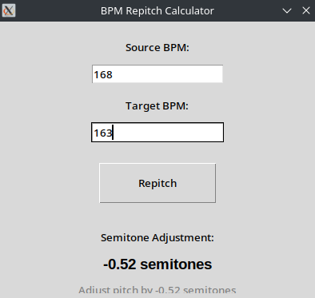

# BPM Repitch Calculator

A cross-platform application for musicians and producers to calculate the pitch adjustment needed to align samples between different BPMs.

## 🎯 Features

- ✅ Accurate semitone calculation
- ✅ Cross-platform executables (Linux, macOS, Windows)
- ✅ Standalone executables (no Python required)

## 📥 Download

Pre-built executables are available in the [dist/](dist/) folder:

- **Linux**: `dist/BPM_Repitch_Calculator`
- **macOS**: `dist/BPM_Repitch_Calculator_mac`
- **Windows**: `dist/BPM_Repitch_Calculator_win.exe`

## 🚀 Usage

### From Source

```bash
# Clone the repository
git clone https://github.com/Donmanouche/bpm-repitch-calculator.git
cd bpm-repitch-calculator

# Install dependencies (if running from source)
python3 -m venv venv
source venv/bin/activate
pip install pyinstaller

# Run the application
python3 bpm_repitch_calculator.py
```

### Using Pre-built Executables

#### Linux/macOS
```bash
chmod +x dist/BPM_Repitch_Calculator*
./dist/BPM_Repitch_Calculator
```

#### Windows
Double-click `dist/BPM_Repitch_Calculator_win.exe` or run from command prompt.

## 🔧 Building Executables

To rebuild the executables:

```bash
# Install PyInstaller
pip install pyinstaller

# Build for current platform
pyinstaller --onefile --windowed --name "BPM_Repitch_Calculator" bpm_repitch_calculator.py

# Build for macOS (universal)
pyinstaller --onefile --windowed --name "BPM_Repitch_Calculator_mac" --target-arch universal2 bpm_repitch_calculator.py

# Build for Windows (requires Wine or Windows machine)
pyinstaller --onefile --windowed --name "BPM_Repitch_Calculator_win" bpm_repitch_calculator.py
```


## 📜 License

MIT License - see [LICENSE](LICENSE) file for details.

## 🖼️ Screenshots




## 🎵 About

This tool is designed for musicians and producers who need to calculate pitch adjustments when time-stretching isn't available or desired. It's particularly useful for:

- Aligning samples to project tempo
- Creating harmonic pitch shifts
- Experimental sound design
- Live performance preparation
